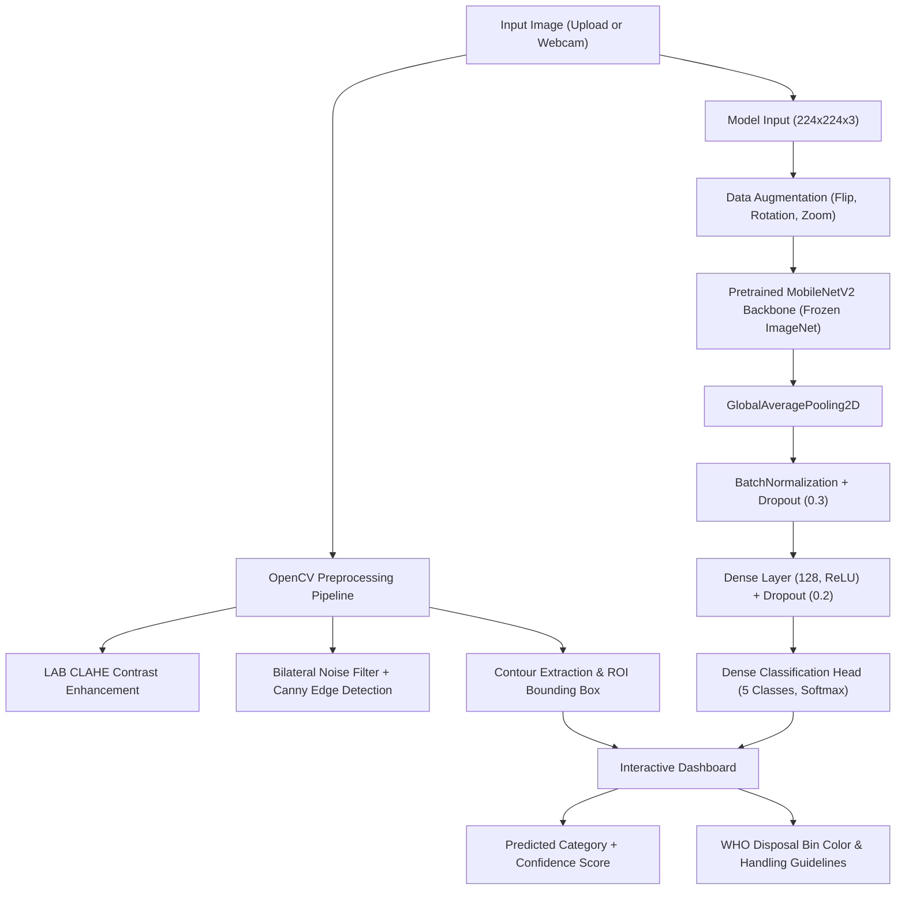
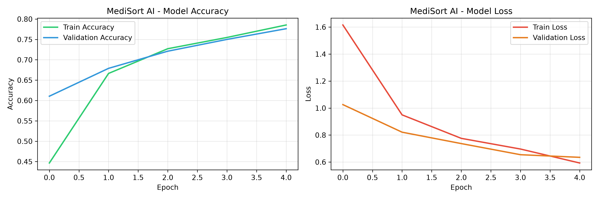
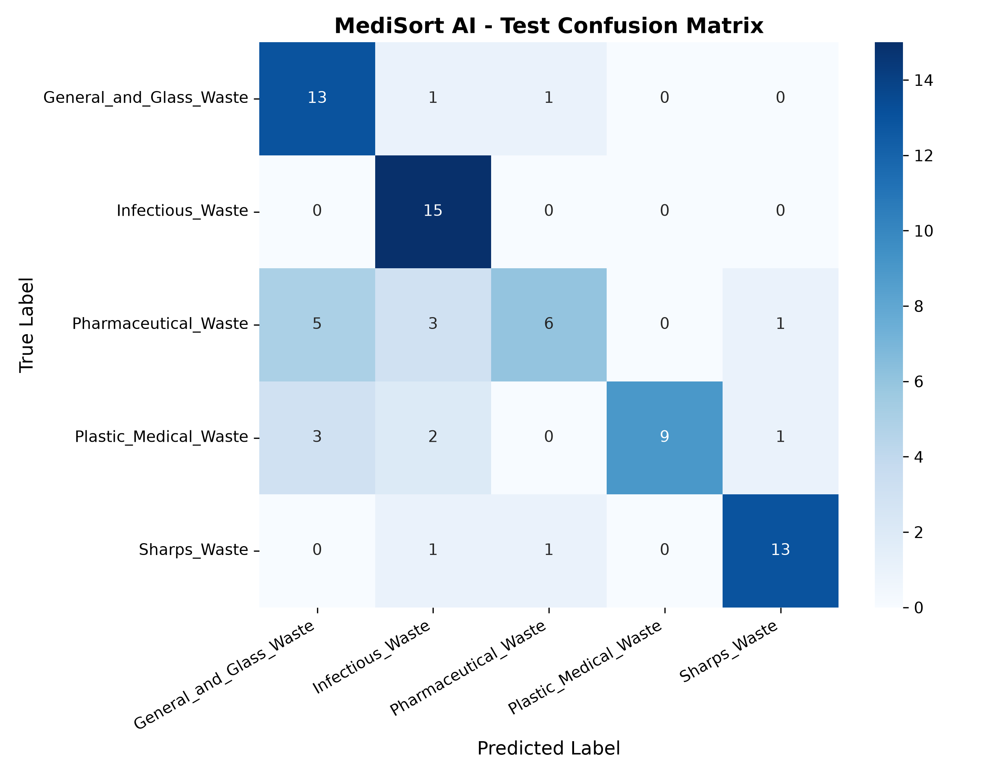
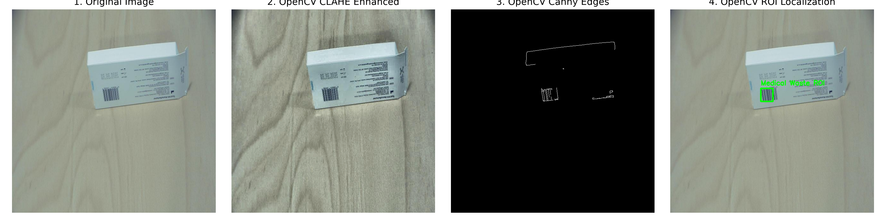
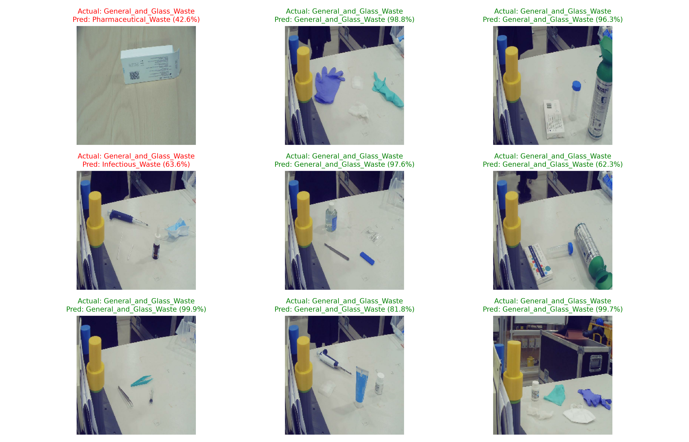

# 🏥 MediSort AI — Deep Learning & CNN-Based Medical Waste Classification

[](https://www.python.org/)
[](https://tensorflow.org/)
[](https://opencv.org/)
[](https://streamlit.io/)
[](LICENSE)

**MediSort AI** is an intelligent biomedical waste image classification and segregation system designed for healthcare environments. Leveraging transfer learning with a pretrained **MobileNetV2** CNN backbone and an advanced **OpenCV** computer vision pipeline, MediSort AI classifies medical waste into **World Health Organization (WHO)** disposal categories, detects waste regions of interest (ROI), and provides real-time color-coded bin recommendations.

---

## 📌 Key Highlights

- **Pretrained MobileNetV2 Transfer Learning:** Lightweight, high-throughput deep neural network optimized for fast inference on clinical edge devices and cloud servers.
- **OpenCV Computer Vision Pipeline:**
  - **CLAHE (Contrast Limited Adaptive Histogram Equalization):** Enhances contrast in challenging medical lighting to reveal translucent plastics, tubing, and needle tips.
  - **Bilateral Filtering & Canny Edge Detection:** Suppresses sensor noise while preserving sharp waste contours.
  - **Automated ROI Localization:** Automatically detects contours and draws bounding boxes around medical waste items.
- **WHO Standard Waste Segregation:** Multi-class classification across 5 standard categories with bin color codes and safe disposal protocols.
- **Interactive Streamlit Web Dashboard:**
  - 📤 **Image Upload:** Drag-and-drop support for `.jpg`, `.jpeg`, and `.png` medical waste images.
  - 📸 **Live Webcam Capture:** Real-time camera feed processing.
  - 🔬 **4-View Diagnostic Panel:** Side-by-side visualization of Original, CLAHE Enhanced, Canny Edges, and ROI Bounding Box.
  - 📊 **Probability Distribution:** Interactive probability breakdown across all 5 classes.
- **Rigorous Evaluation:** Evaluated with Accuracy, Precision, Recall, F1-Score, and Confusion Matrix on held-out test data.

---

## 🗂️ WHO Medical Waste Categories & Disposal Protocol

| Category | Typical Items | Recommended Bin | Disposal & Treatment Protocol |
| :--- | :--- | :--- | :--- |
| **Infectious Waste** | Masks, gloves, gauze, swabs, bandages, bloody dressings | 🟡 **Yellow Biohazard Bin** | High-temperature incineration or double autoclaving |
| **Sharps Waste** | Needles, syringes, scalpels, surgical blades, lancets | ⚪ **White Puncture-Proof Bin** | Needle destruction, shredding & encapsulation in concrete |
| **Pharmaceutical Waste** | Expired drugs, capsules, tablets, chemical reagents | 🟤 **Brown Container** | High-temperature rotary kiln incineration (>1200°C) |
| **Plastic Medical Waste** | IV fluid bottles, tubing, catheters, plastic pipettes | 🔴 **Red Biohazard Bin** | Chemical disinfection, autoclaving, and licensed recycling |
| **General & Glass Waste** | Medicine vials, ampoules, specimen bottles, clean packaging | 🔵 **Blue / Black Bin** | Glassware disinfection & standard municipal recycling |

---

## 🏗️ Architecture & Pipeline



---

## 📊 Experimental Results & Evaluation

The model was evaluated on a held-out test split across all 5 medical waste categories:

### Test Set Metrics
- **Test Accuracy:** **74.67%** (Validation Accuracy: **77.63%**)
- **Weighted Precision:** **78.35%**
- **Weighted Recall:** **74.67%**
- **Weighted F1-Score:** **73.43%**

| Category | Precision | Recall | F1-Score | Support |
| :--- | :---: | :---: | :---: | :---: |
| **Plastic Medical Waste** | **1.00** | 0.60 | 0.75 | 15 |
| **Sharps Waste** | **0.87** | **0.87** | **0.87** | 15 |
| **Infectious Waste** | 0.68 | **1.00** | **0.81** | 15 |
| **General & Glass Waste** | 0.62 | 0.87 | 0.72 | 15 |
| **Pharmaceutical Waste** | 0.75 | 0.40 | 0.52 | 15 |

---

## 🖼️ Visual Results

### 1. Training & Validation Learning Curves


### 2. Confusion Matrix Heatmap


### 3. OpenCV Feature Processing Demonstration


### 4. Sample Test Predictions


---

## 📂 Repository Structure

```text
MedisortAI/
├── app.py                     # Streamlit web application with Image Upload & Live Camera
├── medisortai.ipynb           # End-to-end Jupyter Notebook (EDA, OpenCV, Training, Eval)
├── train_and_evaluate.py      # Standalone training and statistical evaluation script
├── medical_waste_model.h5     # Pretrained MobileNetV2 model weights (5 classes)
├── requirements.txt           # Python dependencies
├── .gitignore                 # Excludes large archives and cache directories
├── README.md                  # Project documentation & benchmark report
├── training_curves.png        # Training & validation accuracy/loss plots
├── confusion_matrix.png       # Test set confusion matrix plot
├── opencv_feature_demo.png    # 4-stage OpenCV pipeline demonstration
└── test_predictions.png       # Held-out test set prediction visualizations
```

---

## 🚀 Quickstart Guide

### 1. Clone the Repository
```bash
git clone https://github.com/Bhuvana-Manogar/MedisortAI.git
cd MedisortAI
```

### 2. Set Up Virtual Environment & Install Dependencies
```bash
python -m venv venv
# Windows:
venv\Scripts\activate
# Linux/macOS:
source venv/bin/activate

pip install -r requirements.txt
```

### 3. Run the Interactive Streamlit Web App
```bash
streamlit run app.py
```
Open your browser at `http://localhost:8501`. You can:
- **Upload** any medical waste photo (`.jpg`, `.png`).
- Use your **live webcam** to classify waste items.
- Inspect the **4-view OpenCV panel** (Original, CLAHE Enhanced, Canny Edges, Bounding Box ROI).
- View **confidence scores** and the recommended **WHO disposal bin**.

### 4. Run the Jupyter Notebook
Open `medisortai.ipynb` in VS Code or Jupyter Lab and run all cells. The notebook is cross-platform compatible and can run locally or in Google Colab.

---

## 🤝 Citation & Dataset

- Dataset based on the **MedBin Dataset** hosted on Roboflow Universe (`uob-ylti8/medbin_dataset`).
- Disposal recommendations aligned with the **World Health Organization (WHO) Guidelines for Safe Management of Wastes from Health-Care Activities**.

---

## 📄 License
This project is licensed under the MIT License.
